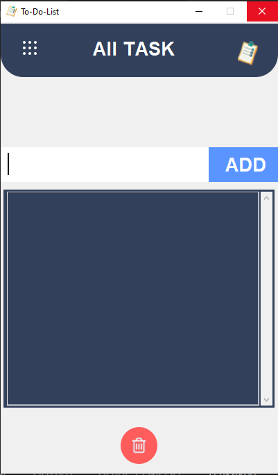

# To-Do List App (Tkinter)

A simple **To-Do List app** built using **Python** and **Tkinter**.

## 📝 Features:
- **Add tasks** to your to-do list.
- **Save tasks** in a local file (`tasklist.txt`).
- **Delete tasks** from the list.

## 🖼 App Screenshot:
 *(You can replace this with an actual screenshot of your app)*

## 🛠️ Requirements:
- **Python 3.x** (any version that supports Tkinter).
- Tkinter (should be pre-installed with Python).
- Images: `task.png`, `topbar.png`, `dock.png`, `delete.png` (ensure these image files are included in your repository).

## ▶️ Installation:

1. Clone the repository:
   ```bash
   git clone https://github.com/your-username/to-do-list-app.git
   cd to-do-list-app
   python todo_list.py

### **Add Other Files**:
- Create an empty file named `tasklist.txt` (this will be used to store your tasks).
- If you don't have it already, create the necessary image files (`task.png`, `topbar.png`, `dock.png`, `delete.png`).

### **Commit and Push Changes**:
Once you’ve added the files, go back to your terminal and run the following commands to commit and push your changes to GitHub:

```bash
git add .
git commit -m "Initial commit with To-Do List app and assets"
git push origin main


